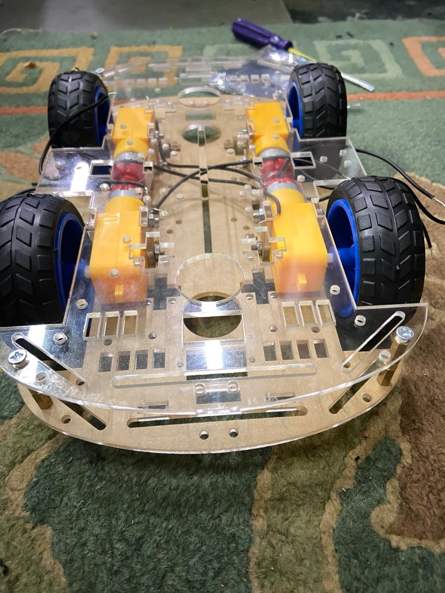
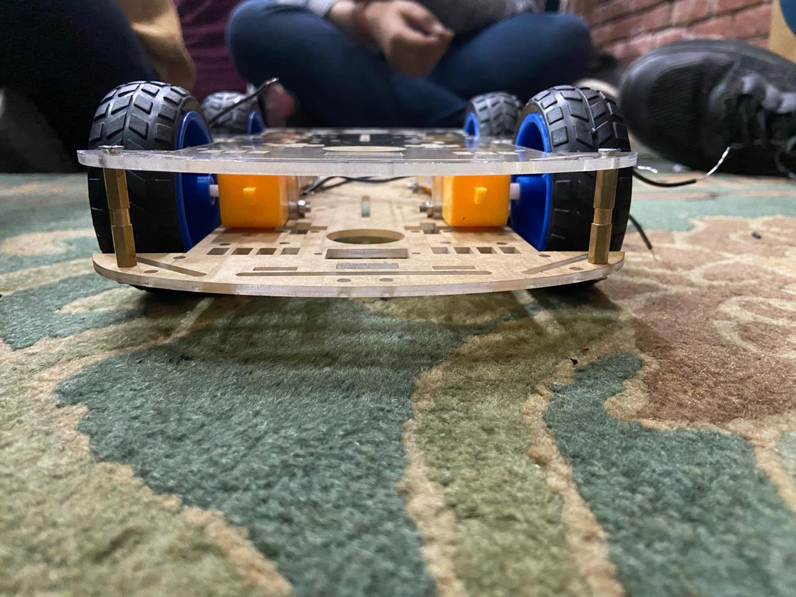
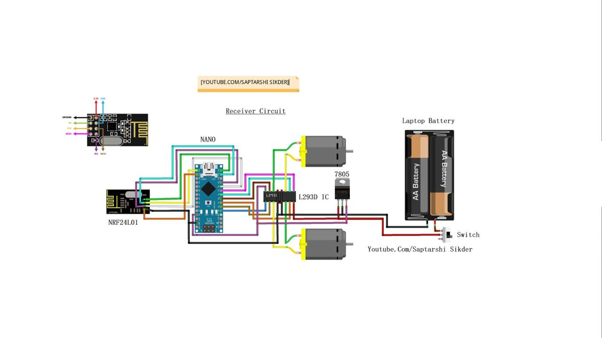
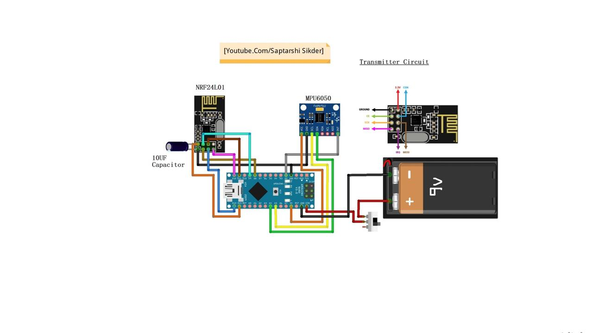

# Gesture Controlled Car 🚗🤖

This project is a wireless gesture-controlled car built using **Arduino Nano, MPU6050 accelerometer + gyroscope sensor, NRF24L01 transceiver modules, and L293D motor driver**.  
By tilting the controller (with MPU6050), the car moves forward, backward, left, or right.

---

## 🔧 Components Used
- Arduino Nano (x2)
- NRF24L01 Transceiver (x2)
- MPU6050 (Accelerometer + Gyroscope)
- L293D Motor Driver IC
- 2 DC Motors
- 7805 Voltage Regulator
- Battery Pack (9V & Laptop Battery)

## ⚙️ Working
1. **Transmitter (Remote):**
   - MPU6050 detects hand gestures (tilt/rotation).
   - Arduino Nano processes sensor data.
   - NRF24L01 transmits commands wirelessly.

2. **Receiver (Car):**
   - Arduino Nano receives commands via NRF24L01.
   - L293D motor driver controls DC motors.
   - Car moves according to hand gestures.

## 📷 Project Images
### Car Prototype

### Remote Controller

### Circuit Connections

## 🎥 Demo Video
[Click here to watch the demo](https://drive.google.com/file/d/1wLg6XZsWouR3Fb6xiKxDd9BF8RGq_Dy1/view?usp=drive_link)

## 💡 Skills Learned
- Internet of Things (IoT) Basics  
- Embedded Systems & Microcontrollers  
- Wireless Communication (NRF24L01)  
- Sensor Integration (MPU6050)  
- Motor Control (L293D)
  
